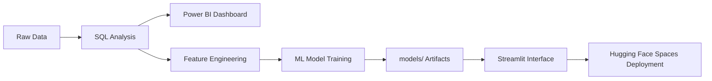

# 💳 Loan Approval & Credit Risk Analytics System

<p align="center">
  <a href="https://huggingface.co/spaces/ajayapradhanconnect/YOUR-APP-LINK" target="_blank">
    
  </a>
  <a href="https://app.powerbi.com/view?r=YOUR-POWERBI-LINK" target="_blank">
    
  </a>
  <a href="https://github.com/ajaya-kumar-pradhan/Loan-Approval-Credit-Risk-Analytics-System" target="_blank">
    
  </a>
</p>

---

## 📌 Project Overview

This project is a complete end-to-end system for **Loan Approval Prediction & Credit Risk Analysis** combining data analysis, business intelligence, and machine learning into a consolidated web application. 

### Key Features
- **SQL Data Analysis:** Extracting and analyzing complex loan application data patterns.
- **Power BI Dashboarding:** Visualizing key performance indicators related to credit risk.
- **Machine Learning:** A robust Random Forest classifier for high-accuracy default predictions.
- **Streamlit Application:** A monolithic, monolithic, beautifully stylized single-page application.
- **Hugging Face Spaces:** Cloud deployments for the interactive portfolio.

---

## 🏗️ System Architecture



---

# 🤖 MACHINE LEARNING METRICS

- Logistic Regression  
- Random Forest (Deployed Model)

| Model | Accuracy | ROC-AUC |
|------|---------|--------|
| Logistic Regression | 78% | 0.81 |
| Random Forest       | 85% | 0.88 |

---

# 🧠 RISK SEGMENTATION

| Segment | Probability | Description |
|--------|------------|------------|
| **Low Risk** | `< 18%` | Strong profile with minimal risk of default |
| **Medium Risk**| `18% - 22%`| Moderate profile requiring standard review |
| **High Risk** | `22% - 30%`| Higher likelihood of default; cautious approval |
| **Very High Risk** | `> 30%` | Severe risk of default |

---

# 💼 BUSINESS IMPACT

- **Automated Workflow:** Accelerates loan approval decisions intelligently.
- **Risk Mitigation:** Identifies high-risk customer segments instantly.
- **Profitability:** Reduces overall financial default risks ensuring higher lending confidence.

---

# 🛠️ TECH STACK

**Python | Streamlit | Scikit-Learn | Pandas | SQL | Power BI | Hugging Face**

---

# 📁 PROJECT STRUCTURE

```text
├── app.py                # Main Streamlit Application logic & UI
├── requirements.txt      # Python dependencies for the Hugging Face Server
├── train_model.py        # ML Training pipeline used to generate artifacts
├── models/               # Saved model artifacts
│   ├── model.joblib      # Random Forest model
│   ├── scaler.joblib     # Preprocessing Scaler
│   └── features.json     # Ordered Feature Definitions
└── README.md             # Project Documentation
```

---

# 🚀 RUN LOCALLY

### 1. Clone the Repository
```bash
git clone https://github.com/ajaya-kumar-pradhan/Loan-Approval-Credit-Risk-Analytics-System.git
cd Loan-Approval-Credit-Risk-Analytics-System
```

### 2. Install Dependencies
```bash
pip install -r requirements.txt
```

### 3. Start the Application
```bash
streamlit run app.py
```

*The application will automatically open in your default browser at `http://localhost:8501/`.*

---

# 👨‍💻 AUTHOR

**Ajaya Kumar Pradhan**
