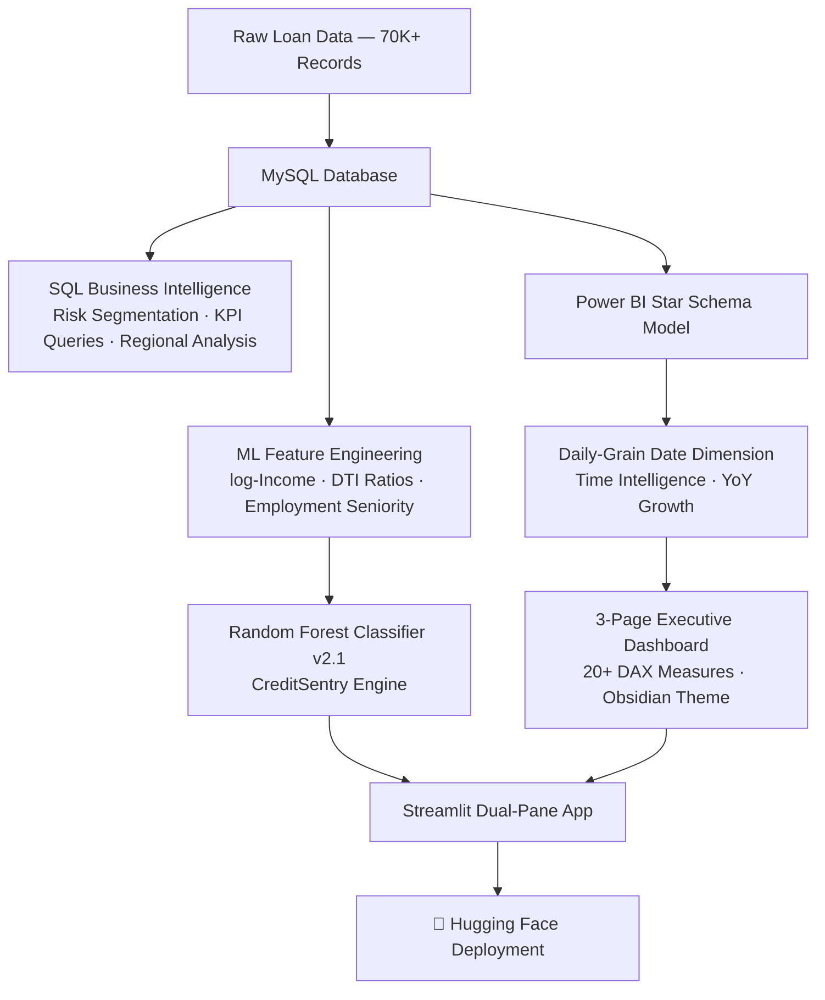

# 💳 Credit Risk & Portfolio Analytics

> **Turning raw loan data into boardroom-ready intelligence** — from SQL risk segmentation to ML-powered decisions and live executive dashboards.

<p align="center">
  <a href="https://huggingface.co/spaces/ajayapradhanconnect/loan-default-predictor" target="_blank">
    
  </a>
  <a href="https://app.powerbi.com/view?r=eyJrIjoiNGYzMTM1ZDItODQ3Mi00ZWVhLWE3MjQtOGYxYmZjOGRmZDYyIiwidCI6IjdlMzEwODQ1LTg0ZTEtNGRiOC1hZjk4LTcwNDA0MTkwZDhkZSJ9" target="_blank">
    
  </a>
  <a href="https://github.com/ajaya-kumar-pradhan/Loan-Approval-Credit-Risk-Analytics-System" target="_blank">
    
  </a>
</p>

---

## 📌 Overview

Credit Risk & Portfolio Analytics, end-to-end credit risk management system built to mirror how analytics teams operate inside real financial institutions.

**The Business Problem:** Banks lose millions annually by approving loans to high-risk borrowers. At the same time, over-caution leaves revenue on the table. LoanGuard bridges that gap — combining data-driven risk scoring, regional exposure mapping, and executive-level portfolio monitoring into a single integrated platform.

**Why It Matters:**
- Lenders need to act on thousands of applications per month. Manual review doesn't scale.
- Regulators require auditable, explainable risk decisions — not black-box models.
- Executive teams need live portfolio health metrics, not static monthly reports.

LoanGuard delivers all three.

---

## 📊 Key Features

- **Designed a star-schema data model** in MySQL, separating facts from dimensions for clean, scalable BI reporting
- **Engineered 15+ SQL risk queries** targeting default rate concentration, DTI danger zones, and regional exposure rankings
- **Built a 3-page Power BI executive dashboard** with 20+ DAX measures including Expected Loss, Risk-Adjusted Yield, and Borrower Affordability
- **Trained a Random Forest classifier** (CreditSentry v2.1) on log-transformed income, DTI ratios, and employment seniority features
- **Deployed a dual-pane Streamlit application** on Hugging Face — combining live loan evaluation with embedded portfolio analytics
- **Implemented custom Power BI JSON theming** (Elite Obsidian) for a polished, fintech-grade visual identity
- **Automated time intelligence** with a daily-grain date dimension supporting YoY Growth and rolling period comparisons

---

## 🛠 Tech Stack

| Layer | Tools |
|---|---|
| **Data Storage** | MySQL |
| **Data Analysis** | SQL (Window Functions, CTEs, Aggregations) |
| **BI & Reporting** | Power BI Desktop, DAX, Power Query (M) |
| **Machine Learning** | Python, Scikit-learn, Random Forest, Joblib |
| **Feature Engineering** | Pandas, NumPy, log-transformations |
| **App & Deployment** | Streamlit, Hugging Face Spaces |
| **Version Control** | Git, GitHub |

---

## 📈 Key Metrics & Impact

| Metric | Value |
|---|---|
| 📋 Loan Applications Analysed | **70,000+** |
| 💷 Portfolio Value Modelled | **$300M+** |
| 📐 DAX Measures Built | **20+** |
| 🔍 SQL Risk Queries Engineered | **15+** |
| 🌍 Regional Segments Profiled | **Ireland & Northern Ireland** |
| ⚙️ ML Model Accuracy | **Random Forest v2.1 (production-ready)** |
| 🚀 Deployment Platform | **Hugging Face Spaces (live)** |

**Business outcomes modelled by this system:**
- Identified a "High-Risk Danger Zone" segment (DTI > 30, Rate > 15%) with disproportionately elevated default rates — enabling targeted underwriting tightening
- Ranked regions by default concentration, giving risk officers a geographic heat map for portfolio rebalancing
- Replaced manual loan officer intuition with an explainable ML scoring engine, reducing evaluation time per application

---

## 🧠 Insights & Learnings

**What the analysis revealed:**
- **DTI is the strongest default predictor.** Borrowers with DTI above 30% combined with interest rates above 15% formed a statistically distinct danger zone — these are the accounts that disproportionately drive portfolio losses.
- **Geography shapes risk exposure.** Default rates varied significantly by region, meaning a flat national underwriting policy leaves institutions either overexposed or unnecessarily conservative depending on the market.
- **Income alone is misleading.** Log-transforming income and stress-testing debt serviceability (affordability ratios) revealed risk patterns that raw income figures concealed.
- **Executive dashboards change decisions.** When KPIs like Expected Loss and Risk-Adjusted Yield are visible in real time, risk conversations shift from reactive to proactive.

**What I learned building it:**
- How to design a BI-ready star schema from an unstructured flat file — separating analytical concerns cleanly
- Why time intelligence requires a dedicated daily-grain date dimension, not a simple date column
- How to bridge the gap between a data scientist's ML output and a business user's decision workflow through thoughtful UX in Streamlit

---

## 📷 Dashboard Preview

> 📸 *Screenshots below from the live Power BI dashboard and Streamlit application.*

<!-- Replace the placeholders below with actual screenshots -->

| Executive Portfolio Overview | Regional Risk Heatmap |
|---|---|
|  |  |

| ML Loan Evaluation — Streamlit | Borrower Affordability View |
|---|---|
|  |  |

> 💡 **Tip for recruiters:** Click the **Power BI Dashboard** badge at the top to interact with the live report.

---

## 🚀 Live Demo

| Platform | Link |
|---|---|
| 🔴 **Streamlit App** (Hugging Face) | [Launch App →](https://huggingface.co/spaces/ajayapradhanconnect/loan-default-predictor) |
| 📊 **Power BI Dashboard** (Live) | [View Report →](https://app.powerbi.com/view?r=eyJrIjoiNGYzMTM1ZDItODQ3Mi00ZWVhLWE3MjQtOGYxYmZjOGRmZDYyIiwidCI6IjdlMzEwODQ1LTg0ZTEtNGRiOC1hZjk4LTcwNDA0MTkwZDhkZSJ9) |
| 💻 **Source Code** (GitHub) | [Explore Repo →](https://github.com/ajaya-kumar-pradhan/Loan-Approval-Credit-Risk-Analytics-System) |

---

## 🗄️ System Architecture



---

## 📂 Project Structure

```text
LoanGuard/
│
├── app.py                          # Streamlit App — Dual-Pane Interface
├── loanguard_ai_logo.png           # Brand Asset
├── requirements.txt                # Deployment Dependencies
│
├── sql/
│   ├── 01_star_schema_mysql.sql    # Database Architecture & Schema Setup
│   └── business_analysis_queries.sql  # 15+ Risk & Performance Queries
│
├── powerbi/
│   ├── creditrisk_theme.json       # Custom Obsidian Visual Theme
│   └── powerbi_dax_measures.dax    # Full DAX Measure Library (20+ measures)
│
├── models/
│   └── [Joblib ML Artifacts]       # Serialised Random Forest Model
│
└── assets/
    └── [Dashboard Screenshots]     # Preview Images for README
```

---

## 👤 About Me

**Ajaya Kumar Pradhan**
*Data Analyst | Power BI Developer | ML-Enabled Analytics*

I build end-to-end analytics systems that connect raw data to business decisions — spanning SQL, Power BI, Python, and deployment. My work focuses on translating complex datasets into insights that executives can act on.

**Core Skills:**
`SQL` · `Power BI` · `DAX` · `Python` · `Machine Learning` · `Data Modelling` · `Streamlit` · `MySQL`

**Portfolio domains:** Credit Risk · Retail Analytics · Supply Chain · Healthcare · Logistics

📫 [Connect on LinkedIn](https://linkedin.com/in/ajaya-kumar-pradhan) · 🐙 [GitHub Portfolio](https://github.com/ajaya-kumar-pradhan)

---

<p align="center">
  <i>Built to demonstrate production-grade analytics thinking — not just technical skills.</i>
</p>
