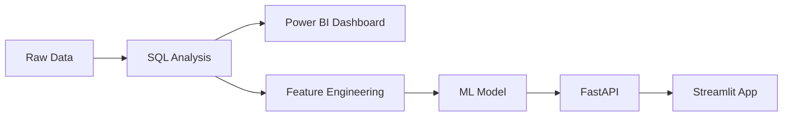

# 💳 Loan Approval & Credit Risk Analytics System

<p align="center">
  <a href="https://huggingface.co/spaces/ajayapradhanconnect/YOUR-APP-LINK" target="_blank">
    
  </a>
  <a href="https://app.powerbi.com/view?r=YOUR-POWERBI-LINK" target="_blank">
    
  </a>
  <a href="https://github.com/ajaya-kumar-pradhan/YOUR-REPO-NAME" target="_blank">
    
  </a>
</p>

---

## 📌 Project Overview

This project is a complete end-to-end system for **Loan Approval Prediction & Credit Risk Analysis** combining:

- SQL for data analysis  
- Power BI for dashboarding  
- Machine Learning for prediction  
- FastAPI for backend  
- Streamlit for frontend  
- Hugging Face for deployment  

---

## 🏗️ System Architecture



---

# 📊 SQL ANALYSIS

## Sample Query

```sql
SELECT 
    Property_Area,
    COUNT(*) AS total_apps,
    SUM(CASE WHEN Loan_Status = 'Y' THEN 1 ELSE 0 END) AS approved,
    ROUND(AVG(LoanAmount),2) AS avg_loan
FROM loan_data
GROUP BY Property_Area;
```

## Sample Output

| Property Area | Total Applications | Approved | Avg Loan |
|--------------|------------------|----------|----------|
| Urban        | 200              | 150      | 140.5    |
| Rural        | 180              | 120      | 130.2    |
| Semiurban    | 220              | 180      | 135.7    |


---

# 📈 POWER BI DASHBOARD

🔗 https://app.powerbi.com/view?r=YOUR-POWERBI-LINK  


---

# 🤖 MACHINE LEARNING

- Logistic Regression  
- Random Forest  

| Model | Accuracy | ROC-AUC |
|------|---------|--------|
| Logistic Regression | 78% | 0.81 |
| Random Forest       | 85% | 0.88 |

---

# 🧠 RISK SEGMENTATION

| Segment | Description |
|--------|------------|
| Low Risk | High income + good credit |
| Medium Risk | Moderate profile |
| High Risk | Low income + poor credit |

---

# 🌐 LIVE APPLICATION

🔗 https://huggingface.co/spaces/ajayapradhanconnect/YOUR-APP-LINK  


---

# ⚙️ FASTAPI

POST /predict

### Request
```json
{
  "income": 5000,
  "loan_amount": 150,
  "credit_history": 1
}
```

### Response
```json
{
  "prediction": "Approved",
  "probability": 0.87,
  "risk_category": "Low Risk"
}
```

---

# 💼 BUSINESS IMPACT

- Automates loan approval decisions  
- Identifies high-risk customers  
- Reduces default risk  

---

# 🛠️ TECH STACK

SQL | Power BI | Python | FastAPI | Streamlit | Hugging Face  

---

# 📁 PROJECT STRUCTURE

```
app.py
api.py
model.pkl
sql/
powerbi/
assets/
notebooks/
requirements.txt
```

---

# 🚀 RUN LOCALLY

```
pip install -r requirements.txt
streamlit run app.py
```

---

# 👨‍💻 AUTHOR

Ajaya Kumar Pradhan
