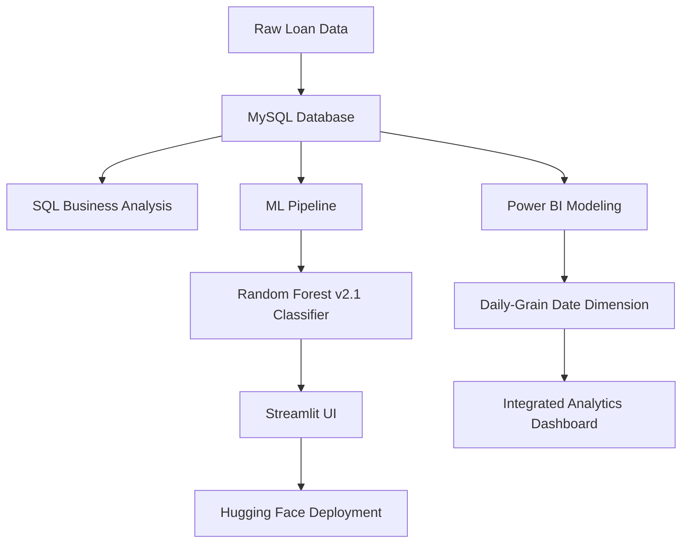

# 💳 LoanGuard: Enterprise Credit Risk & Portfolio Analytics

<p align="center">
  <a href="https://huggingface.co/spaces/ajayapradhanconnect/loan-default-predictor" target="_blank">
    
  </a>
  <a href="https://app.powerbi.com/view?r=eyJrIjoiNGYzMTM1ZDItODQ3Mi00ZWVhLWE3MjQtOGYxYmZjOGRmZDYyIiwidCI6IjdlMzEwODQ1LTg0ZTEtNGRiOC1hZjk4LTcwNDA0MTkwZDhkZSJ9" target="_blank">
    
  </a>
  <a href="https://github.com/ajaya-kumar-pradhan/Loan-Approval-Credit-Risk-Analytics-System" target="_blank">
    
  </a>
</p>

---

## 📌 Project Overview

**LoanGuard** is a comprehensive, end-to-end Credit Risk Management system. It demonstrates a full-stack data science lifecycle—from **raw SQL business intelligence** and **advanced data modeling** to **machine learning deployment** and **interactive executive reporting**.

### 💼 The Business Problem
Banks need to balance lending volume with risk exposure. This project solves that by identifying "at-risk" borrowers before approval and providing executives with real-time portfolio health monitoring.

---

## 🏛️ System Architecture



---

## 🗄️ Phase 1: SQL Business Intelligence
Before modeling, I performed deep-dive analysis on the raw dataset using MySQL to identify core risk drivers.

### Key Analysis Queries

#### 1. Executive KPI Dashboard
*Purpose: At-a-glance health check of the total portfolio.*
```sql
SELECT
    COUNT(*)                                                            AS Total_Apps,
    ROUND(SUM(CASE WHEN is_bad_loan = 1 THEN 1.0 ELSE 0 END) / COUNT(*) * 100, 2) AS Default_Rate_Pct,
    ROUND(SUM(loan_amount) / 1000000.0, 2)                              AS Total_Portfolio_M,
    ROUND(AVG(interest_rate), 2)                                        AS Avg_Rate_Pct
FROM fact_loan;
```

#### 2. Regional Risk Concentration
*Purpose: Identifying geographic "hotspots" for potential defaults.*
```sql
SELECT
    p.region,
    COUNT(f.loan_id)                                                    AS Apps,
    ROUND(SUM(CASE WHEN f.is_bad_loan = 1 THEN 1.0 ELSE 0 END) / COUNT(*) * 100, 2) AS Default_Rate_Pct,
    RANK() OVER (ORDER BY SUM(CASE WHEN f.is_bad_loan = 1 THEN 1.0 ELSE 0 END) / COUNT(*) DESC) AS Risk_Rank
FROM fact_loan f
JOIN dim_property p ON f.property_key = p.property_key
GROUP BY p.region
ORDER BY Default_Rate_Pct DESC;
```

#### 3. The "Danger Zone" Segment
*Purpose: Isolating high-DTI and high-rate clusters that drive losses.*
```sql
SELECT
    CASE WHEN dti > 30 AND interest_rate > 15 THEN 'High Risk Danger Zone' ELSE 'Standard Segment' END AS Risk_Segment,
    COUNT(*) AS Loan_Count,
    ROUND(SUM(CASE WHEN is_bad_loan = 1 THEN 1.0 ELSE 0 END) / COUNT(*) * 100, 2) AS Default_Rate_Pct
FROM fact_loan
GROUP BY Risk_Segment;
```

---

## 📈 Phase 2: Power BI Analytics Hub
I built a professional, three-page dashboard for the bank's executive team, fully integrated into the ML app.

- **Data Modeling**: Upgraded to a daily-grain `dim_date` table to support standard **Time Intelligence (YoY Growth)**.
- **Advanced DAX**: Implemented a library of 20+ measures including `Expected Loss £M`, `Risk-Adjusted Yield`, and `Borrower Affordability`.
- **Elite Obsidian Theme**: Custom JSON-based theme for a sleek, modern fintech look.

---

## 🧠 Phase 3: Intelligent Evaluation (ML)
The **CreditSentry v2.1** engine provides real-time borrower assessment.

- **Model**: Random Forest Classifier.
- **Features**: log-transformed income, DTI ratios, employment seniority, and debt-to-income stress factors.
- **Humanized UI**: Replaced clinical AI jargon with banking terminology like "Loan Evaluation" and "Profile Rank".

---

## 🚀 Phase 4: Full-Stack Integration
The project culminates in a **Dual-Pane Streamlit Application** hosted on Hugging Face.

1. **📝 Loan Evaluation**: An interactive interface for officers to evaluate individual applications.
2. **📈 Performance Insights**: An embedded live Power BI frame for broader portfolio monitoring.

---

## 📁 Project Structure
```text
├── app.py                # Main Streamlit Application (Custom Obsidian Theme)
├── loanguard_ai_logo.png # High-resolution Branding
├── sql/
│   ├── business_analysis_queries.sql # Performance & Risk queries
│   └── 01_star_schema_mysql.sql      # Database Architecture
├── powerbi/
│   ├── creditrisk_theme.json          # Custom Visual Branding
│   └── powerbi_dax_measures.dax       # Full Measure Library
├── models/                           # ML Artifacts (Joblib)
└── requirements.txt                  # Deployment Dependencies
```

---

## 👨‍💻 Author
**Ajaya Kumar Pradhan**
*Data Analyst & Full-Stack Intelligence Developer*
